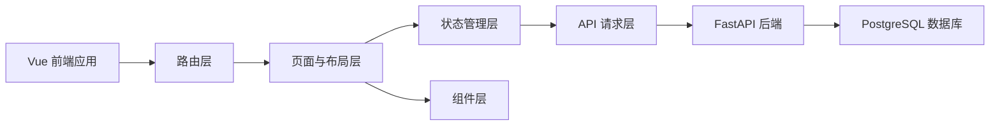
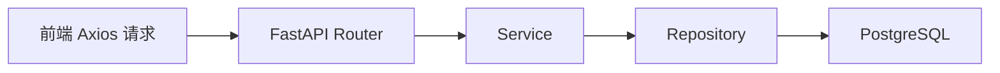
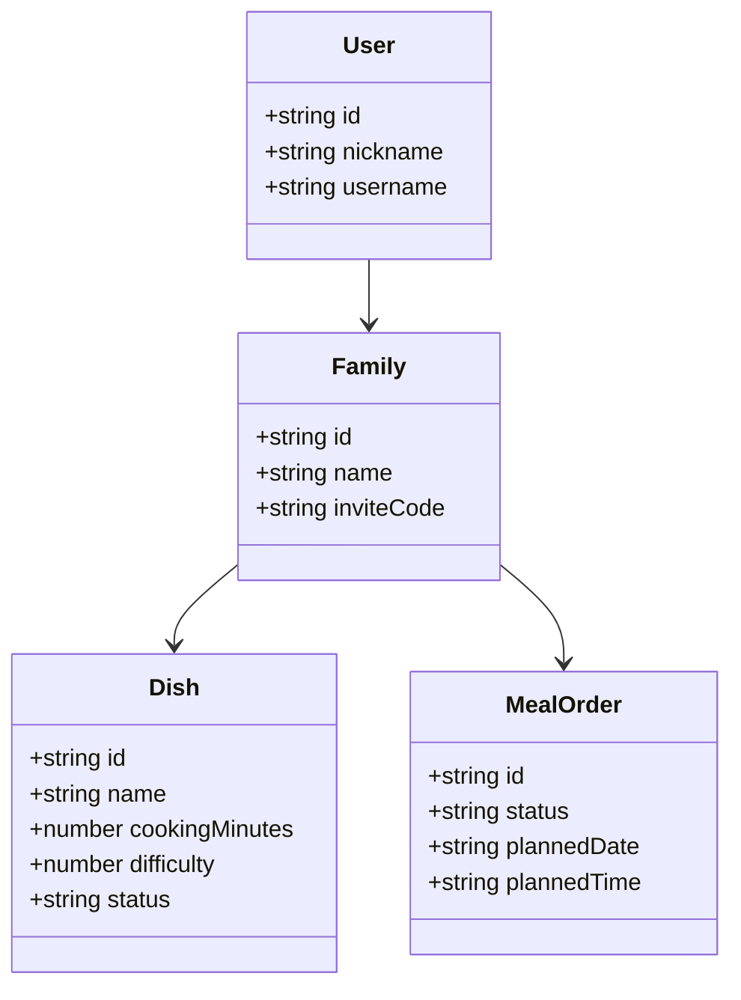

## 1. 架构设计


## 2. 技术说明
- 前端：Vue 3 + TypeScript + Vite
- 初始化工具：`vite-init`
- 路由：Vue Router
- 状态管理：Pinia
- 网络请求：Axios
- UI 组件：Vant
- 日期处理：Day.js
- 表单校验：Zod（预留）
- 样式体系：Tailwind CSS + 自定义设计令牌
- 测试：Vitest

## 3. 路由定义
| 路由 | 用途 |
|-------|---------|
| `/login` | 登录页 |
| `/` | 主框架首页，默认跳转到首页 |
| `/home` | 首页聚合信息 |
| `/dishes` | 菜单列表 |
| `/dishes/:id` | 菜品详情 |
| `/orders` | 点菜列表 |
| `/orders/:id` | 点菜详情 |
| `/plans` | 一周计划 |
| `/profile` | 我的页面 |

点菜列表页当前仅保留 `待确认` 与 `已接受` 两个核心状态入口，不再单独展示 `制作中` 和 `已完成` 入口。

## 4. API 定义
前端仅消费已有 FastAPI 后端接口，本阶段先完成请求封装和类型约束。

```ts
export interface ApiResponse<T> {
  code: number
  message: string
  data: T
}

export interface LoginPayload {
  username: string
  password: string
}

export interface LoginResult {
  access_token: string
  refresh_token: string
  token_type: 'bearer'
  user: {
    id: string
    nickname: string
  }
}

export interface HealthCheckData {
  app_name: string
  environment: string
  status: 'ok'
}
```

## 5. 服务端架构图


## 6. 数据模型
### 6.1 前端核心模型定义


### 6.2 目录约定
```text
frontend/
├── src/
│   ├── api/
│   ├── assets/
│   ├── components/
│   ├── composables/
│   ├── layouts/
│   ├── router/
│   ├── stores/
│   ├── types/
│   ├── utils/
│   ├── views/
│   ├── App.vue
│   └── main.ts
├── public/
├── package.json
├── tsconfig.json
└── vite.config.ts
```

### 6.3 初始化实施约束
- 使用 `vue-ts` 模板初始化，不手写整套 Vite 基础文件。
- 初始化完成后保留并整理 `src/components`、`src/composables`、`src/pages`、`src/utils` 等基础目录。
- 补充 `src/api`、`src/router`、`src/stores`、`src/types` 以便和后端接口结构对齐。
- 优先使用 `npm` 进行依赖安装，随后补充 `vant`、`axios`、`pinia`、`dayjs`、`zod`。
- 完成后执行 `npm run check` 与基础测试，保证 TypeScript 工程可用。
