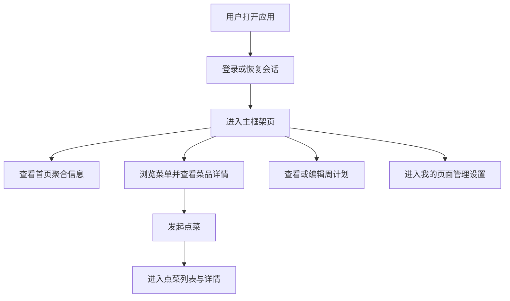

## 1. 产品概述
YY私厨前端是一个服务于双人家庭点菜、做饭协作与用餐记录的移动端优先 Web 应用。
- 项目用于承接后端 FastAPI 接口，快速搭建登录、家庭、菜单、点菜、计划与个人中心等核心使用闭环。
- 第一阶段目标是形成可扩展的 Vue 3 + TypeScript 前端工程，为后续 MVP 功能开发提供统一页面结构、状态管理和请求封装。

## 2. 核心功能
### 2.1 用户角色
| 角色 | 注册方式 | 核心权限 |
|------|----------|----------|
| 家庭管理员 | 用户名密码注册 | 创建家庭、邀请成员、管理菜品与分类、查看全部记录 |
| 家庭成员 | 管理员创建或加入家庭 | 浏览菜品、发起点菜、处理订单、参与评价 |

### 2.2 功能模块
1. **认证模块**：登录页、注册入口、登录状态恢复、退出登录。
2. **首页模块**：今日菜单、待处理点菜、最近常吃、快捷入口。
3. **菜单模块**：菜品列表、分类筛选、搜索、菜品详情。
4. **点菜模块**：我发起的、对方发起的、待确认、已接受、详情时间线。
5. **计划模块**：一周菜单、日历视图、购物清单入口。
6. **我的模块**：个人资料、家庭信息、菜品管理入口、通知与偏好设置。

### 2.3 页面详情
| 页面名称 | 模块名称 | 功能说明 |
|-----------|-------------|---------------------|
| 登录页 | 用户名密码表单 | 支持登录、记住状态、跳转注册或忘记密码占位 |
| 主框架页 | 顶部信息区与底部导航 | 承载首页、菜单、点菜、计划、我的五个主入口 |
| 首页 | 今日菜单卡片 | 展示当日安排、制作状态、负责人 |
| 首页 | 点菜请求卡片 | 展示待处理请求并提供接受、修改、拒绝快捷操作 |
| 菜单页 | 筛选区 | 支持分类、时长、难度、厨师、状态筛选 |
| 菜单页 | 菜品卡片列表 | 展示封面、名称、标签、评分、是否可点 |
| 菜品详情页 | 基础信息与步骤 | 展示菜品详情、食材、步骤、双方偏好与历史摘要 |
| 点菜页 | 订单列表切换 | 展示待确认、已接受等核心状态订单列表 |
| 点菜详情页 | 状态时间线 | 展示发起、接受、准备、制作、上菜、完成等进度 |
| 计划页 | 周计划视图 | 展示未来一周菜单安排与外出用餐标记 |
| 我的页 | 个人与家庭设置 | 展示个人资料、家庭信息、管理入口 |

## 3. 核心流程
用户首次进入系统后完成登录，进入带底部导航的主框架页；在首页查看当日安排和待处理点菜，在菜单页浏览并发起点菜，在点菜页跟进订单状态，在计划页安排未来菜单，在我的页处理个人与家庭配置。

## 4. 用户界面设计
### 4.1 设计风格
- 主色：暖杏色、米白色，强调家庭餐桌的温度感。
- 辅色：墨绿色、番茄红，用于状态区分与操作强调。
- 按钮风格：圆角胶囊按钮，主按钮高对比填充，次按钮浅底描边。
- 字体方案：中文采用温润、清晰的无衬线系统字体栈，标题字重高于正文，强调信息亲和感。
- 布局风格：顶部信息卡片 + 卡片流内容区 + 底部固定导航，核心操作不超过 3 步。
- 图标建议：优先使用简洁线性图标，状态颜色明确，不使用复杂拟物图标。

### 4.2 页面设计概览
| 页面名称 | 模块名称 | UI 元素 |
|-----------|-------------|-------------|
| 登录页 | 登录表单 | 居中卡片、温暖背景渐变、轻量品牌标题、主次操作按钮 |
| 主框架页 | 底部导航 | 5 个 Tab，图标 + 文本，当前页高亮 |
| 首页 | 信息卡片组 | 日期、家庭名称、头像、菜单卡片、待处理请求卡片、快捷按钮 |
| 菜单页 | 筛选与列表 | 顶部筛选条、两列或单列卡片、自适应图片比例、评分标签 |
| 点菜页 | 状态分段栏 | 分段切换、订单卡片、状态色标签、时间摘要 |
| 计划页 | 周视图 | 横向日期栏、计划卡片、外出占位态、清单入口 |
| 我的页 | 设置分组 | 用户信息卡、家庭卡片、管理入口列表、退出按钮 |

### 4.3 响应式设计
- 采用桌面优先的开发与调试方式，同时重点适配 375px 到 430px 的移动端宽度。
- 页面容器宽度在桌面端保持居中并限制最大宽度，移动端使用全宽沉浸式卡片布局。
- 表单与操作按钮需兼容触控尺寸，底部导航与弹层优先考虑手机单手操作。
