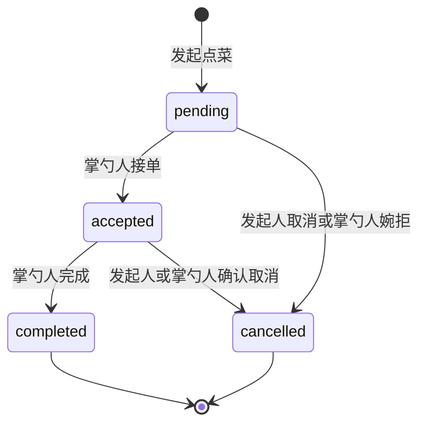

# YY私厨 Web 端优化改造计划

> 文档状态：讨论确认版  
> 编制日期：2026-07-27  
> 适用范围：Web 前端，以及支撑 Web 功能所需的后端、数据库与测试改造  
> 不包含：微信小程序改造

---

## 1. 改造目标

本次改造不将 YY私厨扩展为大型菜谱平台，也不追求一次性实现一周计划、库存管理、复杂购物清单等重功能。

本期目标是保留现有产品简单、温馨、易用的特点，重点完成以下升级：

1. 家庭空间从最多 2 人扩展为最多 5 人。
2. 继续采用“发起人指定一位掌勺人”的点菜模式。
3. 让其他家庭成员通过点赞和加菜建议参与订单，但不能直接修改原订单。
4. 补齐订单的完成、取消和真实用餐记录语义。
5. 让 Web 在 PC 和移动浏览器上都具备合适的布局，而不是 PC 上展示居中的手机版页面。
6. 保留 AI 菜品推荐聊天，并让推荐结果可以顺畅进入点菜流程。
7. 暂时隐藏尚未形成稳定闭环的一周计划、购物清单和 AI 生成购物清单。

### 1.1 核心体验目标

```text
进入家庭空间
  → 浏览家庭菜单或询问 AI
  → 发起人选择菜品并指定掌勺人
  → 其他成员点赞或提交加菜建议
  → 发起人/掌勺人处理建议
  → 掌勺人接单
  → 掌勺人完成订单
  → 发起人评价并沉淀为用餐记录
```

### 1.2 成功标准

- 1～5 名成员可以稳定加入同一个家庭。
- 任一成员均可发起点菜，并指定家庭中的一位其他成员或自己为掌勺人。
- 只有指定掌勺人可以接单和标记完成。
- 非订单控制者不能直接修改原订单菜品。
- 家庭成员可以对订单内菜品点赞，可以提交加菜建议。
- 已接单不再等同于已经吃过；只有已完成订单进入用餐记录。
- PC 与移动端使用相同业务功能，但采用适配各自屏幕的布局。
- AI 推荐可以一键带入点菜创建页，但不能未经确认直接创建订单。
- 隐藏功能不会在导航、快捷入口和直接路由中产生“半成品”体验。

---

## 2. 已确认的产品决策

| 事项 | 确认结论 |
|---|---|
| 家庭人数 | 每个家庭最多 5 人 |
| 主要终端 | 浏览器，同时兼顾 PC 与移动端 |
| 产品复杂度 | 保持简单，不引入大型菜谱、库存或复杂计划系统 |
| 掌勺规则 | 发起点菜时指定一位掌勺人 |
| 接单权限 | 只有指定掌勺人可以接单 |
| 其他成员参与 | 可以点赞、提交加菜建议，不能直接修改原订单 |
| 建议采纳权限 | 待接单时由发起人或掌勺人采纳；接单后只能由掌勺人采纳 |
| 菜品价格 | 保留，用于表达一道菜在家庭菜单中的价值感，不代表真实支付 |
| AI 功能 | 继续保留 AI 菜品推荐聊天 |
| 暂时隐藏 | 一周计划、购物清单、AI 生成购物清单 |

---

## 3. 本期范围与非目标

### 3.1 本期必须完成

- 最多 5 人的家庭空间。
- 多人场景下的成员展示、掌勺人选择和权限校验。
- 订单状态补齐：待接单、已接单、已完成、已取消。
- 订单菜品点赞。
- 加菜建议的提交、采纳、拒绝和撤回。
- 菜品“私厨价”展示及订单价值合计。
- PC/移动端响应式布局。
- AI 推荐结果跳转到点菜创建页并预选菜品。
- 暂时隐藏未完成模块。
- 关键流程的后端与前端自动化测试。

### 3.2 本期明确不做

- 公共菜谱社区、关注、达人、评论广场。
- 在线支付、家庭余额、真实结算或账单系统。
- 完整的一周菜单计划。
- 食材库存、保质期、营养计算。
- 复杂购物清单及买菜平台对接。
- AI 自动执行订单或购物操作。
- 多位掌勺人共同接单。
- 一个账号同时加入多个家庭。
- 微信小程序同步改造。

### 3.3 保留但延后的能力

- 菜品完整食材和步骤编辑。
- 家庭成员移除、主动退出、家庭所有权转移。
- 邀请码轮换与失效时间。
- WebSocket 实时聊天与实时订单协作。
- 菜谱链接、图片和文本智能导入。

这些能力不阻塞本期核心闭环，可以在本期上线稳定后单独评估。

---

## 4. 信息架构调整

### 4.1 主导航

保留 5 个一级入口：

1. 首页
2. 菜单
3. 点菜
4. 消息
5. 我的

### 4.2 二级入口

- “用餐记录”继续放在“我的”和首页快捷入口中。
- “家庭聊天”和“AI聊天”继续放在“消息”中。
- 将代码中的 `PlansPage` 产品语义改为“用餐记录”，建议后续重命名为 `DiningJournalPage`，避免与已隐藏的一周计划混淆。

### 4.3 暂时隐藏的入口

- 不展示“一周计划”入口。
- 不注册或不开放 `/plans` 页面。
- 不展示购物清单入口。
- AI 消息中不展示“生成购物清单”操作卡片。
- 不向用户暴露未完成的直接访问地址。

隐藏优先通过统一功能开关或路由配置实现，避免在多个页面散落硬编码判断。建议增加：

```ts
export const webFeatures = {
  mealPlan: false,
  shoppingList: false,
  aiShoppingAction: false,
  aiDishRecommendation: true,
}
```

---

## 5. 家庭空间改造

### 5.1 数据与规则

- `families.max_members` 默认值由 2 调整为 5。
- 数据迁移将现有家庭的 `max_members` 更新为 5。
- 加入家庭时继续通过服务端事务检查当前人数。
- 保留“一个用户只能加入一个家庭”的现有约束。
- 成员角色本期继续保持 `owner`、`member` 两种，不增加复杂角色体系。

### 5.2 Web 展示

- 家庭资料显示“当前成员数 / 5”。
- 成员列表在移动端纵向排列，在 PC 端使用紧凑网格或横向头像组。
- 创建订单时，掌勺人选择器显示最多 5 名成员，并明确标注“由谁掌勺”。
- 首页家庭摘要由原来的双人文案改为通用家庭文案。
- 全局检查并调整“属于两个人”“双方”等只适用于双人关系的固定文案。

### 5.3 权限边界

- 所有家庭成员都可以查看家庭菜单、订单、用餐记录和家庭聊天。
- 所有家庭成员都可以发起订单。
- 发起订单时必须指定一名当前家庭成员为掌勺人。
- 家庭成员发生变化时，不影响历史订单中的人员快照和展示。

---

## 6. 点菜订单改造

### 6.1 状态机



状态定义：

| 状态 | 中文 | 说明 |
|---|---|---|
| `pending` | 待接单 | 等待指定掌勺人确认 |
| `accepted` | 已接单 | 掌勺人已确认准备该订单 |
| `completed` | 已完成 | 实际完成用餐，可进入记录与评价 |
| `cancelled` | 已取消 | 未继续完成，可保留取消原因和操作人 |

### 6.2 操作权限

| 操作 | 权限 |
|---|---|
| 创建订单 | 任一家庭成员 |
| 接单 | 仅指定掌勺人 |
| 待接单时取消 | 发起人；掌勺人婉拒时也转为取消 |
| 已接单后取消 | 发起人或掌勺人，必须二次确认 |
| 标记完成 | 仅指定掌勺人 |
| 评价 | 保持现有简单规则，由发起人评价，每单一条评价 |
| 查看 | 当前家庭全部成员 |

### 6.3 用餐记录语义修正

- 用餐记录只查询 `completed` 状态订单。
- 首页“本月用餐次数”只统计已完成订单。
- “最常吃菜品”只基于已完成订单计算。
- 已接单但尚未完成的订单继续显示在进行中列表。
- 已取消订单默认折叠展示，不计入用餐统计。

### 6.4 取消信息

订单建议新增：

- `completed_at`
- `cancelled_at`
- `cancelled_by`
- `cancel_reason`

所有状态变化继续写入 `order_status_logs`，便于详情页展示时间线。

---

## 7. 点赞与加菜建议

### 7.1 菜品点赞

点赞对象是订单中的具体菜品项，而不是整张订单。

建议新增 `meal_order_item_reactions`：

| 字段 | 说明 |
|---|---|
| `id` | 主键 |
| `meal_order_item_id` | 订单菜品项 |
| `user_id` | 点赞成员 |
| `reaction_type` | 本期固定为 `like`，保留扩展能力 |
| `created_at` | 点赞时间 |

约束：同一用户对同一订单菜品只能存在一个同类型反应。

交互规则：

- 点击爱心切换点赞/取消点赞。
- 展示点赞数量和最多 3 个成员头像或昵称。
- 发起人、掌勺人和其他成员都可以点赞。
- 点赞不改变订单内容和状态。

### 7.2 加菜建议

建议新增 `meal_order_suggestions`：

| 字段 | 说明 |
|---|---|
| `id` | 主键 |
| `meal_order_id` | 所属订单 |
| `suggester_id` | 建议人 |
| `dish_id` | 建议加入的家庭菜品 |
| `quantity` | 建议数量，默认 1 |
| `note` | 可选说明 |
| `status` | `pending/accepted/rejected/withdrawn` |
| `handled_by` | 处理人 |
| `handled_at` | 处理时间 |
| `converted_order_item_id` | 采纳后生成的订单菜品项 |
| `created_at` | 创建时间 |

### 7.3 建议处理规则

- 当前家庭所有成员都可以从家庭菜单中选择菜品并提交建议。
- 建议不会直接改变订单菜品。
- 订单处于 `pending` 时，发起人或掌勺人可以采纳、拒绝建议。
- 订单处于 `accepted` 时，只有掌勺人可以采纳、拒绝建议。
- `completed` 或 `cancelled` 后不能新增或处理建议。
- 建议人可以在建议未处理前撤回。
- 采纳操作必须在事务中同时创建订单菜品项并更新建议状态，避免重复加入。
- 对同一订单、同一建议人、同一菜品的未处理建议进行前端提示或服务端去重。

### 7.4 详情页布局

订单详情页按以下顺序展示：

1. 状态、用餐日期、掌勺人。
2. 正式订单菜品及每项点赞。
3. 私厨价合计。
4. 待处理加菜建议。
5. 备注。
6. 状态时间线。
7. 接单、完成、取消或评价操作。

移动端使用单列；PC 端建议采用“主内容 + 右侧订单状态/操作栏”双栏布局。

---

## 8. 私厨价设计

### 8.1 产品语义

- 数据库字段暂时继续使用 `price`，避免无必要的数据迁移。
- 用户界面统一展示为“私厨价”。
- 私厨价表达菜品的家庭价值感，不代表真实交易。
- 不出现“付款”“应付”“结算”等支付语义。

### 8.2 展示位置

- 菜单卡片：`私厨价 ¥28`。
- 菜品详情：展示私厨价及简短说明。
- 创建订单：菜品选择时显示单价和数量小计。
- 订单详情：显示“本单私厨价值 ¥xx”。
- 历史记录：可展示当餐私厨价值，但不纳入财务统计。

### 8.3 计算规则

```text
订单私厨价值 = Σ（订单菜品快照价格 × 数量）
```

建议将订单创建时的菜品名称和价格保存为订单项快照，避免后续修改菜品价格导致历史订单金额变化。可新增：

- `meal_order_items.dish_name_snapshot`
- `meal_order_items.unit_price_snapshot`

---

## 9. AI 菜品推荐聊天改造

### 9.1 保留能力

- AI 多轮聊天。
- 根据家庭菜单和历史偏好推荐菜品。
- 冰箱图片辅助识别。
- 推荐理由、所需食材、步骤和参考来源展示。

### 9.2 暂时隐藏

- AI 生成购物清单。
- AI 操作草稿和购物清单确认卡片。
- 与购物清单相关的按钮、提示语和空状态。

### 9.3 推荐到点菜的衔接

为命中家庭菜单中现有菜品的 AI 推荐增加“去点这道菜”：

```text
AI 推荐卡片
  → 点击“去点这道菜”
  → 跳转订单创建页
  → 自动预选对应菜品
  → 用户选择掌勺人、日期和备注
  → 用户确认后创建订单
```

规则：

- AI 不能直接创建订单。
- 推荐结果最好携带稳定的 `dish_id`，不能只依赖菜名匹配。
- 如果推荐菜不属于当前家庭菜单，只展示推荐内容，不提供自动点菜按钮。
- 跳转参数只作为初始化值，订单创建页仍须重新校验菜品可用性。

### 9.4 简化 AI 输出

- 面向普通用户默认隐藏原始模型输出和技术工具轨迹。
- 推荐卡片优先展示：菜名、推荐理由、匹配家庭偏好的原因、操作按钮。
- 检索来源和工具调用信息可以放进“为什么这样推荐”折叠区。
- AI 服务失败时提供明确重试，不影响家庭聊天和普通点菜。

---

## 10. PC 与移动端响应式改造

### 10.1 现状问题

当前普通页面主要使用 `max-w-[480px]` 容器，PC 上仍展示手机宽度，并固定使用底部导航。虽然功能可操作，但没有充分利用桌面空间。

### 10.2 布局断点

| 屏幕 | 建议布局 |
|---|---|
| `< 768px` | 移动端单列、底部导航 |
| `768px～1023px` | 平板/小窗口，较宽单列或局部双列 |
| `≥ 1024px` | PC 左侧导航、桌面内容区 |

### 10.3 应用壳层

移动端：

- 保留现有底部导航。
- 保留安全区和触控尺寸。
- 页面宽度填满设备，内容保持合适边距。

PC 端：

- 改用固定或粘性左侧导航。
- 左侧显示 Logo、5 个主入口和当前家庭摘要。
- 主内容区最大宽度控制在 1180px 左右。
- 底部导航不显示。
- 用户资料与退出入口放在侧栏底部或“我的”页面。

### 10.4 页面级响应式建议

| 页面 | 移动端 | PC 端 |
|---|---|---|
| 首页 | 单列卡片 | 今日餐桌为主栏，待处理/历史为侧栏 |
| 菜单 | 1～2 列 | 3～4 列卡片，搜索和新增固定在顶部 |
| 点菜列表 | 单列分组 | 状态筛选 + 两列订单卡片 |
| 订单详情 | 单列 | 菜品与互动主栏 + 状态操作侧栏 |
| 创建订单 | 分步骤单列 | 菜品选择与订单摘要双栏 |
| 消息中心 | 两张纵向卡片 | 家庭聊天、AI聊天并列 |
| 家庭聊天 | 全屏单列 | 左侧会话信息，右侧聊天主体；本期可先只扩宽主体 |
| AI聊天 | 全屏单列 | 保持已有宽布局，优化推荐卡片排列 |
| 我的 | 单列设置卡片 | 资料、家庭、记录分区展示 |

### 10.5 表单与弹层

- 移动端继续使用底部弹层。
- PC 端使用居中对话框或右侧抽屉。
- 保持同一份表单逻辑，避免分别维护两套页面。
- 所有主要操作支持鼠标、键盘和触屏。

---

## 11. 页面改造清单

### 11.1 首页

- 家庭成员文案支持 1～5 人。
- 今日订单明确展示状态、掌勺人和家庭成员互动数量。
- 待处理区域区分“等我接单”“待完成”“待评价”。
- 月度统计改为只统计已完成订单。
- PC 端使用主次双栏。
- 移除一周计划和购物清单相关入口。

### 11.2 菜单页

- 保留当前简单创建流程。
- “价格”文案改为“私厨价”。
- PC 端增加多列布局。
- 菜品卡片可以显示被点次数或近期热度，但本期不增加复杂筛选。
- 可将烹饪时长、辣度、适合工作日等已有字段放进折叠的“更多信息”，作为可选增强，不阻塞首期上线。

### 11.3 创建订单页

- 掌勺人选择支持最多 5 名成员。
- 菜品选择显示私厨价和小计。
- 展示固定订单摘要栏。
- 支持从 AI 推荐通过 `dish_id` 预选菜品。
- 提交前校验掌勺人仍属于当前家庭、菜品仍可用。

### 11.4 点菜列表页

- 增加“进行中、已完成、已取消”视图。
- “进行中”包含待接单和已接单。
- 卡片展示掌勺人、发起人、日期、菜品、建议数量和互动数量。
- 优先突出与当前用户相关的待处理订单。

### 11.5 订单详情页

- 增加菜品点赞。
- 增加加菜建议区。
- 增加完成和取消操作。
- 增加私厨价值合计。
- 状态时间线展示操作人。
- 根据当前用户权限精确展示按钮，不依赖按钮隐藏作为唯一权限控制。

### 11.6 消息中心与 AI聊天

- 保留家庭聊天与 AI聊天。
- 移除 AI 购物清单相关交互。
- AI 推荐卡片增加“去点这道菜”。
- PC 消息中心使用两列卡片。

### 11.7 我的与用餐记录

- 成员数量改为 `/5`。
- 用餐记录只展示已完成订单。
- 将页面与组件命名中的 `Plans` 逐步改为 `DiningJournal`。
- 隐藏一周计划和购物清单入口。

---

## 12. 后端与数据库改造

### 12.1 数据库迁移

建议新增一条 Alembic migration，包含：

1. 家庭人数默认值改为 5，并更新现有数据。
2. `meal_orders` 增加完成与取消字段。
3. `meal_order_items` 增加菜品名称、价格快照。
4. 新增订单菜品反应表。
5. 新增加菜建议表。
6. 为订单状态、家庭订单时间、建议状态增加必要索引。

### 12.2 模型与 Schema

需要调整或新增：

- `Family.max_members`
- `MealOrderStatus.COMPLETED`
- `MealOrderStatus.CANCELLED`
- `MealOrder.completed_at`
- `MealOrder.cancelled_at`
- `MealOrder.cancelled_by`
- `MealOrder.cancel_reason`
- `MealOrderItem` 快照字段
- `MealOrderItemReaction`
- `MealOrderSuggestion`
- 点赞、建议、完成、取消相关请求与响应 Schema

### 12.3 API 设计

建议接口：

```text
POST   /orders/{order_id}/complete
POST   /orders/{order_id}/cancel

PUT    /orders/{order_id}/items/{item_id}/like
DELETE /orders/{order_id}/items/{item_id}/like

POST   /orders/{order_id}/suggestions
POST   /orders/{order_id}/suggestions/{suggestion_id}/accept
POST   /orders/{order_id}/suggestions/{suggestion_id}/reject
POST   /orders/{order_id}/suggestions/{suggestion_id}/withdraw
```

订单详情响应补充：

- 每个菜品的点赞数量、当前用户是否点赞、点赞成员摘要。
- 建议列表及处理权限。
- 当前用户可执行的操作集合，或由前端依据明确权限字段计算。
- 订单私厨价值合计。

### 12.4 并发与事务

- 接单、完成、取消必须锁定订单或使用条件更新，避免重复状态转换。
- 采纳建议必须保证建议状态更新和新增订单项原子完成。
- 点赞接口必须具备幂等性。
- 家庭加入人数检查需要在事务中执行，避免并发加入超过 5 人。
- 服务端始终执行权限校验，不能仅依赖前端按钮显示。

---

## 13. Web 前端代码改造

### 13.1 类型与 API

- 扩展订单状态联合类型。
- 增加订单反应和建议类型。
- 扩展订单详情类型和操作 API。
- AI 推荐结果增加可选 `dish_id`。
- 订单创建页支持路由预选参数。

### 13.2 Store

- `orderStore` 增加完成、取消、点赞、建议处理 action。
- 每次操作只更新受影响订单，避免无条件刷新全部列表。
- 对点赞使用乐观更新，失败时回滚并提示。
- 对接单、完成、取消和建议采纳使用服务端结果覆盖本地状态。

### 13.3 组件建议

可新增：

- `ResponsiveAppShell.vue`
- `DesktopSidebar.vue`
- `OrderStatusBadge.vue`
- `OrderItemReactionBar.vue`
- `OrderSuggestionCard.vue`
- `OrderValueSummary.vue`
- `FamilyMemberPicker.vue`

已有页面组件优先拆分复用，不为 PC 和移动端复制两套业务组件。

### 13.4 性能优化

- 当前家庭聊天未读数每 3 秒轮询一次，建议调整为页面聚焦时立即刷新、后台停止、可见期间 10～15 秒轮询。
- 聊天页面本期继续使用轮询，WebSocket 放到后续。
- 图片增加懒加载和合理尺寸。
- 列表更新尽量局部化。
- 保持路由懒加载。

---

## 14. 测试计划

### 14.1 后端测试

必须覆盖：

- 第 5 名成员可以加入，第 6 名被拒绝。
- 非家庭成员不能读取或操作订单。
- 非指定掌勺人不能接单、完成订单。
- 待接单、已接单、已完成、已取消的合法与非法状态转换。
- 用餐记录和统计只包含已完成订单。
- 点赞幂等和取消点赞。
- 建议在不同订单状态下的采纳权限。
- 同一建议不能重复采纳。
- 采纳建议后生成的订单项价格快照正确。
- 并发加入家庭和并发采纳建议不产生脏数据。

### 14.2 前端单元测试

必须覆盖：

- 订单状态筛选和显示文案。
- 当前用户不同身份下的操作按钮。
- 点赞乐观更新与失败回滚。
- 建议提交、采纳、拒绝和撤回。
- AI 推荐跳转后正确预选菜品。
- 功能开关关闭时不出现计划和购物入口。

### 14.3 响应式验收

至少验证以下宽度：

- 375px：常见手机。
- 768px：平板或窄浏览器。
- 1024px：小型 PC。
- 1440px：标准桌面显示器。

页面需检查：登录、首页、菜单、创建订单、订单列表、订单详情、消息中心、家庭聊天、AI聊天、我的、用餐记录。

### 14.4 建议增加的端到端场景

```text
成员 A 创建家庭
→ B、C、D、E 加入
→ F 加入失败
→ A 发起点菜并指定 B 掌勺
→ C 点赞已有菜品
→ D 建议加菜
→ A 在待接单阶段采纳建议
→ B 接单
→ E 再次建议加菜
→ A 无法在接单后采纳，B 可以采纳
→ B 完成订单
→ A 评价
→ 订单进入用餐记录和月度统计
```

---

## 15. 分阶段实施计划

### 阶段 0：范围收口与半成品隐藏

任务：

- 增加统一功能开关。
- 隐藏计划、购物清单、AI 购物动作。
- 保留 AI 推荐聊天。
- 将计划/手账命名统一为“用餐记录”。

验收：用户无法从导航、快捷入口或直接路由进入未完成模块。

### 阶段 1：家庭 5 人与响应式应用壳层

任务：

- 数据迁移和家庭人数规则改造。
- 成员相关文案与选择器改造。
- PC 左侧导航、移动底部导航。
- 首页、菜单、点菜、消息、我的基础响应式布局。

验收：5 名用户可以加入家庭；核心页面在 375px 和 1440px 下均可正常使用。

### 阶段 2：订单状态与私厨价

任务：

- 新状态及状态接口。
- 完成、取消和状态时间线。
- 用餐记录与首页统计语义修正。
- 订单项名称和价格快照。
- 私厨价及订单价值合计展示。

验收：从待接单到完成形成真实闭环，历史统计不再把已接单当作已用餐。

### 阶段 3：点赞与加菜建议

任务：

- 反应和建议数据表、接口与权限。
- 订单详情互动组件。
- 点赞乐观更新。
- 建议采纳事务与状态处理。

验收：5 人家庭中，不同身份严格遵守已确认的建议处理规则。

### 阶段 4：AI 推荐衔接点菜

任务：

- AI 推荐结构补充 `dish_id`。
- 推荐卡片增加“去点这道菜”。
- 创建订单页支持预选。
- 默认折叠技术轨迹。

验收：AI 只能帮助用户生成点菜初始选择，不能绕过用户确认创建订单。

### 阶段 5：质量与上线准备

任务：

- 补齐后端、前端和端到端测试。
- 响应式视觉验收。
- 权限、并发、错误态检查。
- 轮询频率和图片加载优化。
- 更新 README、接口文档和部署说明。

验收：自动化测试和生产构建通过，关键验收场景全部通过。

---

## 16. 优先级

### P0：没有这些不能发布

- 最多 5 人及服务端人数校验。
- PC/移动响应式应用壳层。
- 完成、取消状态和用餐记录语义修正。
- 指定掌勺人的权限校验。
- 暂时隐藏半成品模块。
- 数据迁移和关键测试。

### P1：形成多人家庭差异化

- 菜品点赞。
- 加菜建议及采纳规则。
- 私厨价快照和订单价值合计。
- AI 推荐一键进入点菜。
- 页面级桌面布局优化。

### P2：上线后的体验增强

- 邀请码轮换、退出家庭、移除成员。
- 更完善的菜品可选信息。
- WebSocket 实时协作。
- 菜谱导入。
- 重新评估计划和购物清单。

---

## 17. 主要风险与处理方式

| 风险 | 处理方式 |
|---|---|
| 2 人扩为 5 人后权限混乱 | 将所有操作权限写成服务端规则并逐项测试 |
| 历史订单价格随菜单修改 | 使用订单项快照 |
| 建议被重复采纳 | 行锁或条件更新，并在同一事务创建订单项 |
| PC 改版破坏移动体验 | 共享组件，只在布局层做响应式调整；按四个宽度验收 |
| 隐藏功能仍能通过 URL 进入 | 路由层结合功能开关控制，不只隐藏按钮 |
| AI 推荐与菜单菜名匹配错误 | 使用 `dish_id`，名称只用于展示 |
| 订单完成状态上线影响旧数据 | 迁移时保持旧 `accepted` 订单为已接单，不自动推断已完成；必要时提供一次性人工确认 |

---

## 18. 上线与数据迁移建议

1. 先在测试环境备份数据库。
2. 执行家庭人数和订单字段迁移。
3. 旧家庭统一将人数上限调整为 5。
4. 旧 `accepted` 订单不自动转换为 `completed`，避免制造错误历史。
5. 如现有数据量较少，可由家庭成员在新版中手工将确实完成的旧订单标记为完成。
6. 部署后重点观察加入家庭、接单、完成、建议采纳和 AI 跳转错误。
7. 保留快速关闭点赞、建议和 AI 跳转入口的前端功能开关，但数据库结构不回滚。

---

## 19. 完成定义

只有同时满足以下条件，本次 Web 改造才算完成：

- 产品确认的多人规则全部落地。
- 任何未授权用户都无法通过直接调用 API 越权操作订单。
- PC 端不再只是 480px 的居中移动页面。
- 移动端原有核心操作没有回退。
- 订单只有完成后才进入用餐记录和统计。
- 点赞与建议不会直接绕过订单控制者修改订单。
- AI 推荐可以辅助点菜，但所有写操作都需要用户明确确认。
- 暂时隐藏的模块不存在可见入口或半成品承诺。
- 后端测试、前端测试、Lint、类型检查和生产构建全部通过。
- 关键端到端验收场景通过。

